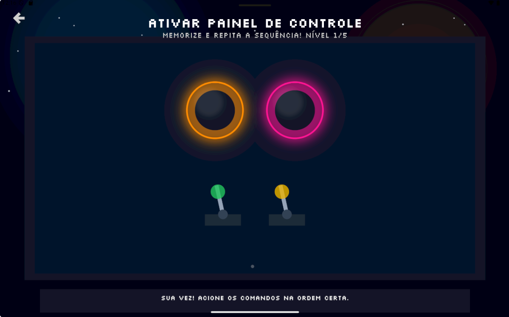
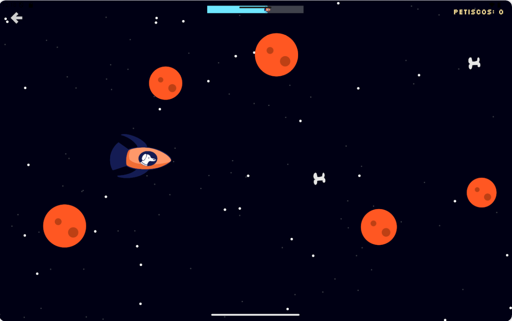
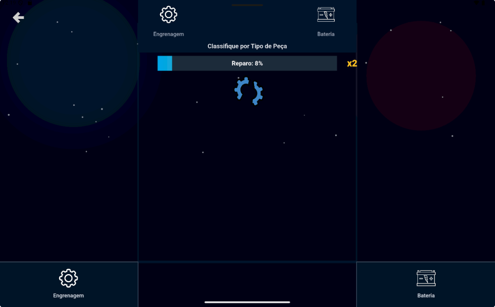

# SPACE: System for Purposive Attention and Cognitive Exercise

A serious mobile game designed to help children with ADHD enhance their executive
functions through research-backed minigames. Developed as a final
graduation project (PFG, *Projeto Final de Graduação*) at the
**Universidade Estadual de Campinas (UNICAMP)** by
**Gustavo Miller Santos** and **Maria Eduarda Rocha**.

---

## About the Game

SPACE is based on research from other serious games that have shown proven
impact in improving executive functions such as **working memory**, **selective
attention**, and **cognitive flexibility**. The game wraps therapeutic
exercises inside an adventure narrative to keep children motivated and engaged.

### The Story

The protagonist is **Laika**, a dog. When her human best friend
travels to space and disappears, Laika sets out on a rescue mission. Each leg
of her journey is a minigame focused on a different executive function.

**Story Mode** is a 5-chapter narrative that introduces Laika's quest and
integrates each minigame as a story challenge (starting the engine, dodging
asteroids, repairing the ship). Completing chapters unlocks the corresponding
minigames for standalone play.

### The Minigames

| # | Minigame | Executive Function | Gameplay |
|---|----------|-------------------|----------|
| 1 | **Control Panel** | Working Memory | A Simon Says-style sequence memorization game. The player must remember and repeat an increasingly longer sequence of commands to start the rocket's engine. |
| 2 | **Asteroid Field** | Selective Attention | The player navigates the rocket through an asteroid belt, dodging obstacles and fake explosions while ignoring distractions on screen. Collectible treats provide bonus points. |
| 3 | **Broken Ship Repair** | Cognitive Flexibility | The ship is damaged and must be repaired. The player classifies falling pieces into the correct bins, but the sorting criterion changes over time: first by shape, then by color, then by state (broken/whole), with rules cycling unpredictably at the highest difficulty. |

### Screenshots

<p align="center">
  
  &nbsp;
  
  &nbsp;
  
</p>

### Progression & Features

- **Player profiles**: multiple local players supported via SQLite storage
- **Story progress**: tracked per player; minigames start locked and are
  unlocked by completing story chapters
- **Difficulty settings**: Easy, Medium, Hard
- **Ranking**: per-minigame leaderboard with win/loss, score, difficulty, and
  date
- **Audio**: volume control with mute toggle

### Difficulty Scaling

Each difficulty level affects gameplay parameters across all three minigames.
Difficulty is a global setting, selectable from the main menu settings panel.

#### Control Panel (Working Memory)

| Parameter | Easy | Medium | Hard |
|-----------|------|--------|------|
| Max rounds to win | 5 | 6 | 8 |
| Sequence playback flash duration | 0.6s | 0.5s | 0.4s |
| Sequence playback gap between flashes | 0.4s | 0.3s | 0.2s |
| Delay before next round | 1.2s | 0.9s | 0.7s |

#### Asteroid Field (Selective Attention)

| Parameter | Easy | Medium | Hard |
|-----------|------|--------|------|
| Scrolling speed multiplier | 1.0x | 1.3x | 1.7x |
| Asteroid spawn interval | 1.0s | 0.8s | 0.6s |
| Fake explosion spawn interval | 2.2s | 1.76s | 1.32s |
| Petisco (bone) spawn interval | 1.6s | 1.28s | 0.96s |
| Finish distance (pixels) | 5000 | 7000 | 10000 |

#### Broken Ship Repair (Cognitive Flexibility)

| Parameter | Easy | Medium | Hard |
|-----------|------|--------|------|
| Repair progress per correct sort | 4% | 3% | 2% |
| Object fall speed | 65 px/s | 85 px/s | 110 px/s |
| Rule transition flash duration | 2.0s | 1.5s | 1.0s |

---

## Research Background

SPACE's design is informed by a body of research on serious games for children
with ADHD. The following studies were particularly influential in shaping the
three-minigame structure and the executive-function focus:

| Reference | What it contributes |
|-----------|-------------------|
| Dovis, S., Van der Oord, S., Wiers, R. W., & Prins, P. J. M. (2015). Improving Executive Functioning in Children with ADHD: Training Multiple Executive Functions within the Context of a Computer Game. *PLOS ONE*, 10(4), e0121651. [DOI](https://doi.org/10.1371/journal.pone.0121651) | **Braingame Brian**: the most direct inspiration for SPACE. A story-driven game that trains working memory, inhibition, and cognitive flexibility through multiple embedded minigames, with an external reward system to maintain motivation. |
| Ramos, D. K., & Garcia, F. A. (2019). Jogos Digitais e Aprimoramento do Controle Inibitório: um Estudo com Crianças do Atendimento Educacional Especializado. *Revista Brasileira de Educação Especial*, 25(1). [DOI](https://doi.org/10.1590/S1413-65382519000100003) | **Escola do Cérebro**: a Brazilian platform integrating classic cognitive games (including Genius, the direct parallel to Minigame 1). Demonstrates improvements in inhibitory control and attention in children with special educational needs. |
| Kollins, S. H., Childress, A., Heusser, A. C., & Lutz, J. (2021). Effectiveness of a digital therapeutic as adjunct to treatment with medication in pediatric ADHD. *npj Digital Medicine*, 4, 58. [DOI](https://doi.org/10.1038/s41746-021-00429-0) | **EndeavorRx**: an FDA-cleared digital therapeutic that trains selective attention by requiring the player to multitask (navigate a path while responding to targets and ignoring distractions). Directly parallels the design of Minigame 2 (Asteroid Field). |
| Feria-Madueño, A., Monterrubio-Fernández, G., Mateo Cortes, J., & Carnero-Diaz, A. (2024). The Effect of a Novel Video Game on Young Soccer Players' Sports Performance and Attention: Randomized Controlled Trial. *JMIR Serious Games*, 12, e52275. [DOI](https://doi.org/10.2196/52275) | **BallApp**: a memory and attention game where the player memorizes which ball has a distinct color as positions and colors change every 5 seconds. Demonstrates transfer of cognitive training to real-world performance. |
| Monserrat Gallardo, M., & Gallardo Vergara, R. (2023). Serious Games as Attention Training in Children with ADHD. *Revista CES Psicología*, 16(2), 86–102. [DOI](https://doi.org/10.21615/cesp.6418) | Reviews multiple game designs for ADHD children, detailing motivation for design choices: 4 levels with different scenarios/difficulties, mazes for spatial memory, spot-the-difference for visual comparison, and selective attention tasks. |
| Aghdam, K. S., & Alavi, M. H. (2019). Designing MIND PRO Working Memory Game and evaluating its effectiveness on working memory in ADHD children. *2019 International Serious Games Symposium (ISGS)*, 124–128. [DOI](https://doi.org/10.1109/ISGS49501.2019.9047038) | **MIND PRO**: a working-memory game with auditory and visual sections. Players identify boxes producing distinct sounds (auditory) or matching images (visual), directly informing the memory-sequence design of Minigame 1. |
| Wiguna, T., Ismail, R. I., Kaligis, F., Minayati, K., Murtani, B. J., Wigantara, N. A., Pradana, K., Bahana, R., Dirgantoro, B. P., & Nugroho, E. (2021). Developing and feasibility testing of the Indonesian computer-based game prototype for children with ADHD. *Heliyon*, 7(7), e07571. [DOI](https://doi.org/10.1016/j.heliyon.2021.e07571) | An RPG where children deliver colored fruits to matching houses while remembering delivery instructions and navigating around distractor cars. Combines working memory, planning, and attention in a single game loop. |
| Bul, K. C., Kato, P. M., Van der Oord, S., Danckaerts, M., Vreeke, L. J., Willems, A., … Maras, A. (2016). Behavioral Outcome Effects of Serious Gaming as an Adjunct to Treatment for Children With ADHD: A Randomized Controlled Trial. *Journal of Medical Internet Research*, 18(2), e26. [DOI](https://doi.org/10.2196/jmir.5173) | **Plan-it Commander**: a mission-driven online game with 10 missions and multiple side-quests, embedding minigames that target time management, planning, organization, working memory, and social skills within a unified narrative framework. |
| Crepaldi, M., Colombo, V., Mottura, S., Baldassini, D., Sacco, M., Cancer, A., & Antonietti, A. (2020). Antonyms: A Computer Game to Improve Inhibitory Control of Impulsivity in Children with ADHD. *Information*, 11(4), 230. [DOI](https://doi.org/10.3390/info11040230) | **Antonyms**: players act as superheroes in a realm where rules are inverted. Must inhibit impulsive actions to advance. Directly addresses cognitive flexibility and inhibitory control, paralleling the rule-switching mechanic in Minigame 3. |
| Kim, S.-C., Lee, H., Lee, H.-S., Kim, G., & Song, J.-H. (2022). Adjuvant Therapy for Attention in Children with ADHD Using Game-Type Digital Therapy. *International Journal of Environmental Research and Public Health*, 19(22), 14982. [DOI](https://doi.org/10.3390/ijerph192214982) | **NeuroWorld DTx**: 6 games, 4 focused on attention and 2 on working memory. Features include rapid shape/color matching of moving objects, spatial obstacle avoidance, and animal character memorization. |
| Hashemian, Y., Gotsis, M., & Baron, D. (2014). Adventurous Dreaming Highflying Dragon: A full body game for children with ADHD. *2014 IEEE International Symposium on Mixed and Augmented Reality (ISMAR)*, 341–342. [DOI](https://doi.org/10.1109/ISMAR.2014.6948479) | Demonstrates the use of multiple minigames (attention, eye-hand coordination, impulsivity control) within a single title for ADHD children: validating the multi-minigame approach adopted by SPACE. |
| Soysal, O. M., Kiran, F., & Chen, J. (2020). Quantifying Brain Activity State: EEG analysis of Background Music in a Serious Game on Attention of Children. *2020 4th International Symposium on Multidisciplinary Studies and Innovative Technologies (ISMSIT)*, 1–7. [DOI](https://doi.org/10.1109/ISMSIT50672.2020.9255308) | Investigates how background music influences attention during gameplay. Though focused on neurotypical children, it informed design considerations for the audio environment in SPACE. |
| García-Redondo, P., García, T., Areces, D., Núñez, J. C., & Rodríguez, C. (2019). Serious Games and Their Effect Improving Attention in Students with Learning Disabilities. *International Journal of Environmental Research and Public Health*, 16(14), 2480. [DOI](https://doi.org/10.3390/ijerph16142480) | Evaluates games that target specific intelligences (logical-mathematical, spatial) with 10 sub-games each. Provides evidence for multi-dimensional cognitive training through game-based interventions. |

---

## Technical Overview

### Technology Stack

| Component | Technology |
|-----------|-----------|
| **Game Engine** | [Flame](https://flame-engine.org/) 1.37, a 2D game engine built on Flutter |
| **Language** | Dart (SDK ^3.11.5) |
| **UI Framework** | Flutter (Material Design) |
| **Audio** | `flame_audio` 2.12.1 |
| **Local Database** | SQLite via `sqflite` 2.3.0 |
| **Fonts** | Silkscreen (pixel font) via `google_fonts` 8.1.0 |
| **SVG** | `flutter_svg` 2.3.0 |
| **Platforms** | Android, iOS, Web, Windows, macOS, Linux |

### Architecture

The game uses **Flame's RouterComponent** for screen-based navigation, with all
routes defined in `lib/src/game/game.dart`. The main class `SpaceGame` extends
`FlameGame` and acts as the central coordinator, managing routes, story
progress, unlocked minigames, and player data.

#### Design Patterns

- **Atomic Design** - UI components are organized as `atoms/` (small primitives:
  buttons, cards, modal shells) and `molecules/` (composite components: database
  helper, game modal)
- **Route + World + Controller** - Each minigame follows this triad:
  - `*_route.dart`: Camera setup and world instantiation
  - `*_world.dart`: Rendering, input handling, and game loop
  - `*_controller.dart`: Pure state machine (no rendering, no Flutter imports)

#### Project Structure

```
lib/src/game/
├── game.dart                          # Core SpaceGame (FlameGame + Router)
├── menu.dart                          # Main menu
├── story_mode.dart                    # 5-chapter narrative mode
├── user_select.dart                   # Player profile selection
├── ranking.dart                       # Leaderboard
├── minigames.dart                     # Minigame selector
├── shared/
│   ├── settings.dart                  # Global game settings (difficulty, volume)
│   ├── atoms/                         # UI primitives (buttons, cards, modals)
│   ├── molecules/                     # Composites (database, game modal)
│   └── widgets/                       # Flutter overlay widgets
├── control_panel/                     # Minigame 1: Working Memory
│   ├── control_panel_route.dart
│   ├── control_panel_world.dart
│   ├── control_panel_controller.dart
│   └── components/                    # Buttons, levers, backdrop
├── asteroid_field/                    # Minigame 2: Selective Attention
│   ├── asteroid_field.dart
│   └── components/                    # Rocket, asteroids, explosions, stars
└── broken_ship/                       # Minigame 3: Cognitive Flexibility
    ├── broken_ship_route.dart
    ├── broken_ship_world.dart
    ├── broken_ship_controller.dart
    └── components/                    # Sorting objects, bins, rule display
```

#### Database Schema (SQLite)

- **users** — `id`, `name`, `story_progress`, `unlocked_minigames`
- **ranking** — `id`, `user_id`, `minigame`, `played_at`, `result`, `score`, `difficulty`

---

## How to Run

```bash
cd space
flutter pub get
flutter run
```

Make sure you have the [Flutter SDK](https://flutter.dev) installed and a
device/emulator connected.

---

## Acknowledgments

### Development

All code was written by **Gustavo Miller Santos** and **Maria Eduarda Rocha**,
with assistance from AI tools (**GitHub Copilot** and **DeepSeek**).

### Advisor

This project was advised by **Prof. Emanuel Felipe Duarte** at the Institute
of Computing, UNICAMP.

### Art

No AI art was used in this game. The logo and character art were created by
**Sara Beatriz Da Silva Oliveira**.

### Sound Effects

| File | Author | Source | License |
|------|--------|--------|---------|
| `correct.mp3` | Rob_Marion (GASP_UI_Confirm.wav) | [freesound.org/s/542044](https://freesound.org/s/542044) | CC0 |
| `incorrect.mp3` | timgormly (Training Program, Incorrect1.aif) | [freesound.org/s/181858](https://freesound.org/s/181858) | CC0 |
| `success.mp3` | oysterqueen | [freesound.org/s/582988](https://freesound.org/s/582988) | CC0 |
| `whoosh.mp3` | StudioKolomna (Fast Whoosh) | [pixabay.com](https://pixabay.com/sound-effects/film-special-effects-fast-whoosh-118248) | — |
| `pad_a.mp3` | floraphonic (90s Game UI 4) | [pixabay.com](https://pixabay.com/sound-effects/film-special-effects-90s-game-ui-4-185097) | — |
| `pad_b.mp3` | floraphonic — modified with higher pitch | (see pad_a) | — |
| `pad_c.mp3` | Artninja (custom_lever_pulling_sounds_02182026) | [freesound.org/s/845787](https://freesound.org/s/845787) | CC BY 4.0 |
| `pad_d.mp3` | Artninja — modified with deeper pitch | (see pad_c) | CC BY 4.0 |
| `asteroid_hit.mp3` | Lumora_Studios (Pixel Explosion) | [pixabay.com](https://pixabay.com/sound-effects/film-special-effects-pixel-explosion-319166/) | — |
| `ui_click.mp3` | Jummit (Soft UI Button Click) | [freesound.org/s/528561/](https://freesound.org/s/528561/) | CC0 |
| `menu_bgm.mp3` | Musinova (IDM Electronic Atmospheric Background) | [pixabay.com](https://pixabay.com/music/upbeat-idm-electronic-atmospheric-background-414214/) | — |
| `bgm.mp3` | Benjamin Tissot (Extreme Action) | [bensound.com](https://www.bensound.com/royalty-free-music/track/extreme-action) | License: 54J9PXM6YDMQ5KVQ |

### Images

- Gear SVG by Dazzle UI — [svgrepo.com/svg/532244/gear](https://www.svgrepo.com/svg/532244/gear)
- Mouse clicker icons by Upnow Graphic — [flaticon.com/free-icon/click_14993969](https://www.flaticon.com/free-icon/click_14993969)

---

## License

This project is licensed under the MIT License. See [LICENSE](LICENSE) for details.
